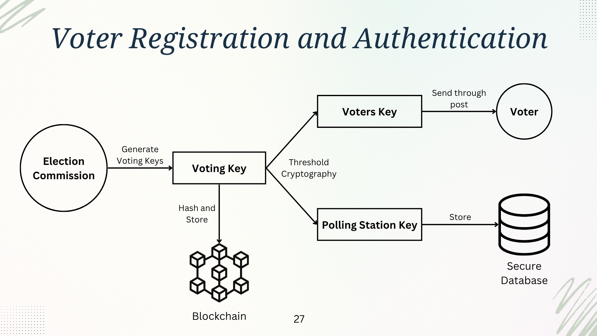
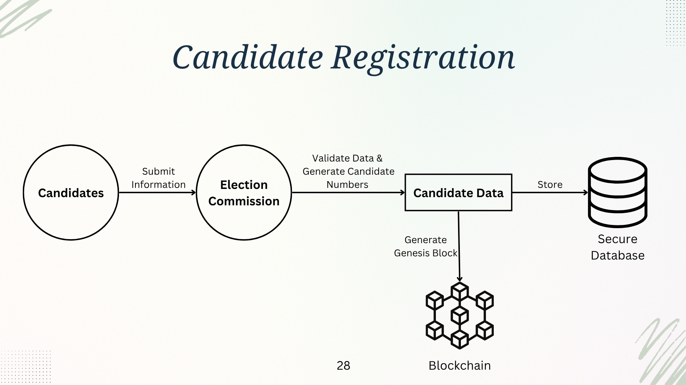
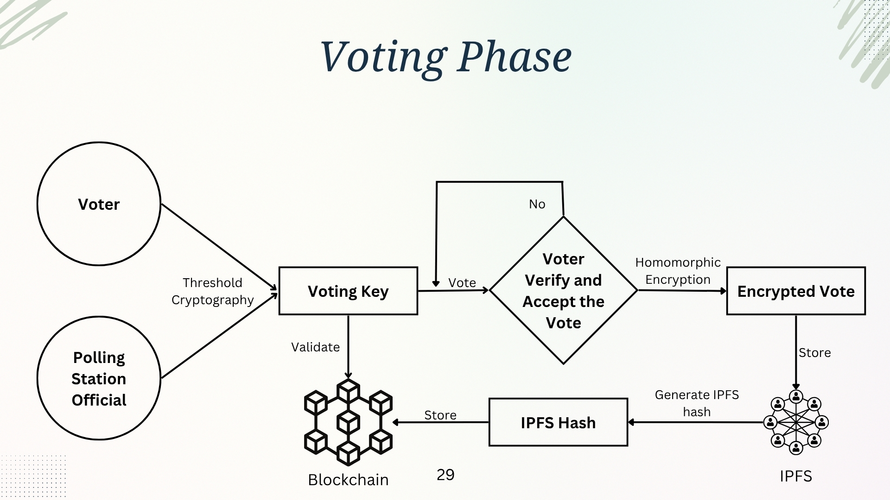
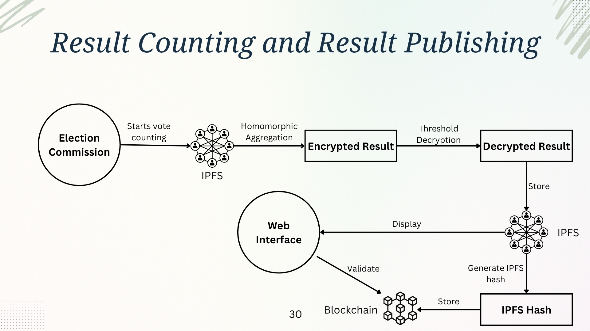

---
# Blockchain Based E-Voting System
---

## Project Description

This project explores the development of a **secure, transparent, and verifiable blockchain-based electronic voting (e-voting) system** aimed at addressing the challenges of traditional paper-based and centralized electronic voting systems. By leveraging blockchain technology, the system ensures **ballot secrecy, voter verifiability, contestability, and auditability**, making elections more secure and resistant to tampering.

The research involves a **comprehensive analysis of existing e-voting systems**, expert interviews with blockchain and cybersecurity professionals, and case study evaluations to identify potential improvements. A prototype of the e-voting system will be developed and tested with a controlled user group to assess **usability, security, and scalability**.

### Key Objectives

✅ **Enhancing security** by preventing fraud and unauthorized modifications to votes  
✅ **Ensuring transparency** through a decentralized and immutable ledger  
✅ **Providing voter verifiability** without compromising ballot secrecy  
✅ **Analyzing usability and accessibility** through user feedback and expert reviews

Through this research, we aim to contribute to the **future of digital democracy** by demonstrating the feasibility of blockchain-based e-voting systems while addressing potential challenges and limitations.

## High-Level System Architecture

There are three system states:

1. **Pre-Election**

   - Voter Registration and Authentication
   - Candidate Registration

2. **During Election**

   - Voting Phase

3. **Post-Election**

   - Result Counting and Publishing

---

### Voter Registration and Authentication

The Voter Registration Module verifies voter identities and securely assigns cryptographic voting keys. This module interacts with the election commission database to store voter records securely.

**Components:**

- **Election Commission (EC):** Responsible for verifying and registering voters.
- **Secure Voter Database:** Stores voter details (not on the blockchain).
- **Threshold Cryptography Key Generation:** Splits the voter’s key into two parts.
- **Blockchain:** Stores only the hashed voter key for verification.

**Process Flow:**

1. Voter submits registration details.
2. EC verifies identity and generates a voting key pair using threshold cryptography.
3. One part of the key is sent via registered mail; the other is stored in the database and used at the polling station.
4. The hashed key is stored on the blockchain for verification.

---

### Candidate Registration

The Candidate Registration Module ensures only eligible candidates are registered and that their details are securely stored on the blockchain.

**Components:**

- **Election Commission:** Verifies and approves candidate applications.
- **Candidate Database:** Stores candidate details securely.
- **Blockchain:** Stores candidate names, party affiliations, and assigned candidate IDs in the genesis block.

**Process Flow:**

1. Candidates submit their application with the required documents.
2. EC verifies eligibility and assigns a unique candidate ID.
3. Candidate details are added to the private blockchain to ensure immutability.

---

### Voting Process

The Voting Module enables voters to cast encrypted votes securely using threshold cryptography and homomorphic encryption. Votes are stored off-chain in IPFS, while only their hashes are recorded on the blockchain.

**Components:**

- **Voter Authentication:** Voters must provide both key parts for authentication.
- **Encrypted Ballot Casting:** Votes are encrypted using homomorphic encryption.
- **IPFS Storage:** Encrypted votes are stored in a decentralized manner.
- **Blockchain:** Stores only the IPFS hash to ensure vote integrity.

**Process Flow:**

1. Voter authenticates using both key parts.
2. Voter selects a candidate.
3. Vote is encrypted using homomorphic encryption and stored on IPFS.
4. The IPFS hash is recorded on the blockchain.

---

### Counting and Result Publication

The Counting & Result Module aggregates encrypted votes off-chain using homomorphic encryption and publishes the final result on the blockchain.

**Components:**

- **Homomorphic Vote Aggregation:** Computes results without decrypting individual votes.
- **Threshold Decryption:** Only the final tally is decrypted using multi-party decryption.
- **Blockchain & IPFS:** Stores final election results and enables public verification.
- **Web Interface:** Displays results in a verifiable and transparent manner.

**Process Flow:**

1. Encrypted votes are retrieved from IPFS.
2. Homomorphic encryption is used to compute vote tallies without decryption.
3. The final tally is decrypted and stored on IPFS; its hash is recorded on the blockchain.
4. The results are displayed via a secure web interface.
